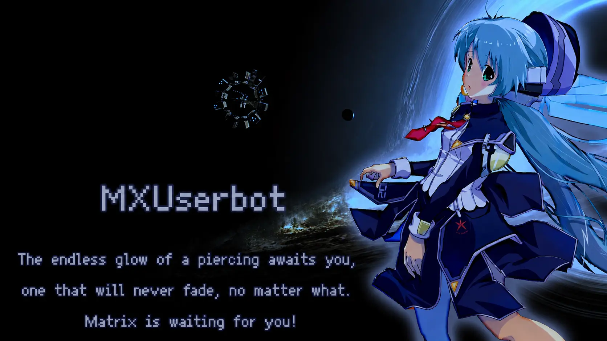
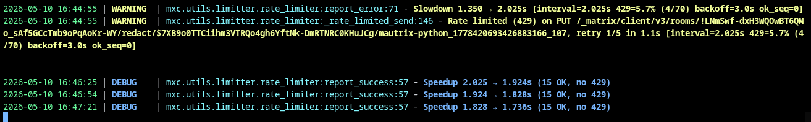
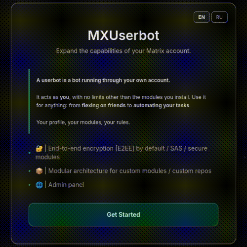
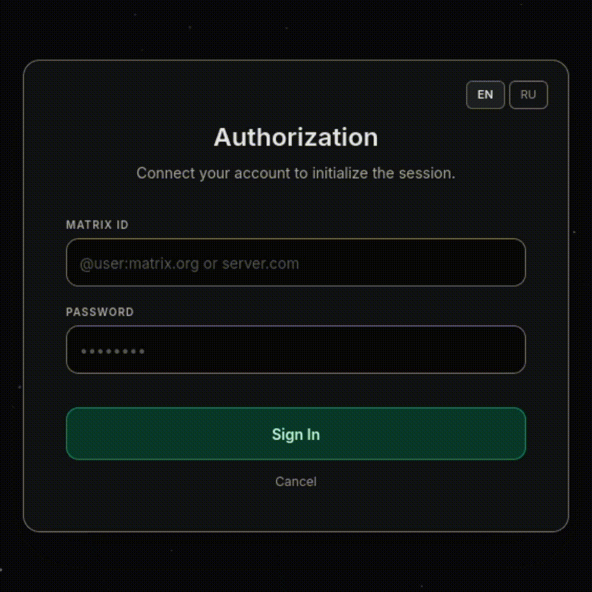
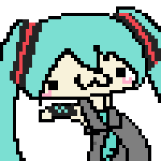

  <h1>✨ | MXUserbot | ✨</h1>
  
   

 

  <b>What is a userbot:</b> A bot that runs directly on your account, acting on your behalf. 
  <b>Purpose:</b> From showing off to your friends that you use bot commands from your account to automation and useful modules. It all depends on you!

<b>SPACE:</b> <a href="https://matrix.to/#/#SpacePashaHatsune:matrix.org">Matrix Space</a>

<h3>Contribution</h3>

  We accept <b>Issues</b> and <b>Pull requests</b>. 
  If you have ideas or code — send them over, I will review everything.

<h3>✨ | Feature</h3>

<table cellspacing="0" width="100%">
 <tr>
  <td width="50%" style="border:1px solid #30363d;padding:0;vertical-align:top">
<b>Emoji Callbacks</b> - Reactions as buttons.
<video src="https://raw.githubusercontent.com/MxUserBot/MXUserbot/main/assets/promo/EMOJICALLBACK.mp4" controls width="100%" style="display:block"></video></td>
  <td width="50%" style="border:1px solid #30363d;padding:0;vertical-align:top">
<b>FSM</b> - Multi-step dialogs with state persistence.
<video src="https://raw.githubusercontent.com/MxUserBot/MXUserbot/main/assets/promo/FSM.mp4" controls width="100%" style="display:block"></video></td>
 </tr>
</table>

<table cellspacing="0" width="100%">
 <tr>
  <td width="50%" style="border:1px solid #30363d;padding:0;vertical-align:top">
<b>Web Panel</b> - Manage modules/account via web panel
<video src="https://raw.githubusercontent.com/MxUserBot/MXUserbot/main/assets/promo/SITE.mp4" controls width="100%" style="display:block"></video></td>
  <td width="50%" style="border:1px solid #30363d;padding:0;vertical-align:top">
<b>SUDO LIST</b> - Grant your friend permission to execute commands 
<video src="https://raw.githubusercontent.com/MxUserBot/MXUserbot/main/assets/promo/SUDO.mp4" controls width="100%" style="display:block"></video></td>
 </tr>
</table>

<table cellspacing="0" width="100%">
 <tr>
  <td width="50%" style="border:1px solid #30363d;padding:0;vertical-align:top">
<b>SAS Verification</b> - Verify your device anywhere!.
<video src="https://raw.githubusercontent.com/MxUserBot/MXUserbot/main/assets/promo/VERIF.mp4" controls width="100%" style="display:block"></video></td>
  <td width="50%" style="border:1px solid #30363d;padding:0;vertical-align:top">
<b>Module Repository</b> — add custom repositories!
<video src="https://raw.githubusercontent.com/MxUserBot/MXUserbot/main/assets/promo/REPOS.mp4" controls width="100%" style="display:block"></video></td>
 </tr>
</table>

 

<table cellspacing="0" width="100%">
 <tr>
  <td width="100%" style="border:1px solid #30363d;padding:0;vertical-align:top">
<b>Rate Limiter</b> - AIMD-based protection against "Too Many Requests" allows you to run your userbot on any server!.
</td>
 </tr>
</table>

 

<h3>Installation</h3>

<table cellspacing="0" cellpadding="0" style="border-collapse: collapse; width: 100%;">
  <tr>
    <td width="50%" style="padding: 0 10px 0 0; vertical-align: top; border: none;">
      
      

        Login via SSO
      

    </td>
    <td width="50%" style="padding: 0; vertical-align: top; border: none;">
       
      

        Login via @user:server
      

    </td>
  </tr>
</table>

 

<h4>Docker</h4>
<pre><code>git clone https://github.com/PashaHatsune/MxUserbot.git
cd MxUserbot
docker-compose up --build</code></pre>

<h4>Manual Installation on <a href="https://docs.astral.sh/uv/#highlights">uv</a></h4>
<pre><code>git clone https://github.com/PashaHatsune/MxUserbot.git
cd MxUserbot
uv sync
uv run -m src.mxuserbot</code></pre>

 

<h3>Documentation</h3>

<a href="https://mxuserbot.github.io/documentation/">https://mxuserbot.github.io/documentation/</a>

<h3>Donate</h3>

<a href="https://destream.net/live/Pashahatsune/donate">https://destream.net/live/Pashahatsune/donate</a>

 

<h3>Credits</h3>
<ul>
  <li><b>@ArThirtyFour</b> — thanks for help with the code/banner.</li>
  <li><b>@maseckt</b> — thanks for help with the code/videos.</li>
</ul>

 

<h2>Disclaimer</h2>

  This software is provided <b>"as is"</b>, without warranty of any kind, express or implied. By using this userbot, you acknowledge that:

<ul>
  <li><b>Full Responsibility:</b> You are solely responsible for your actions and any consequences resulting from the use of this software.</li>
  <li><b>No Liability:</b> The developer shall not be held liable for any damages, including but not limited to account bans, data loss, or legal issues.</li>
  <li><b>Strict Prohibition:</b> Use of this bot for fraudulent activities, spam, or any actions that violate terms of service or local laws is strictly prohibited.</li>
</ul>

 

    

