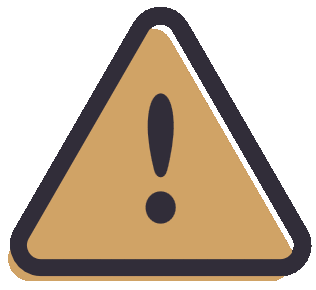

<h1> Community Module Security</h1>

The security of running user (community) modules in <strong>MXUserbot</strong> relies on two core principles:

<h2>1. YOU and Your Personal Responsibility</h2>

As a user of the userbot, YOU must clearly understand: <strong>the core does not have multi-layered protection against malicious scripts</strong>, nor does it run modules in a separate isolated environment (sandbox).
 

<blockquote>
    <em>This is quite difficult for a single developer on the team to implement, so it is what it is :)</em>
</blockquote>

 

Therefore, YOU accept full responsibility for installing modules that come <strong>NOT</strong> from the system repository. The system repository is considered trusted by default, as all modules there undergo strict review and testing before being added to the database.

<h3> Your Security Rules:</h3>
<ul>
    <li><strong>Self-Audit:</strong> YOU must independently check the source code of each community module for malicious functions.</li>
    <li><strong>How to check code if you are not a programmer:</strong> 
        <ul>
            <li>Look out for third-party links in the code (sending data to unknown websites).</li>
            <li>Watch out for strange, unreadable character sets (obfuscation) or hidden commands.</li>
            <li><strong>In doubt?</strong> Drop the module's code into an AI with a request to analyze it for vulnerabilities, or visit our <a href="https://matrix.to/#/!DdlQBKibuvXIWTbBvP:matrix.org?via=pashahatsune.pp.ua&via=matrix.org">SUPPORT</a> room.</li>
        </ul>
    </li>
    <li><strong>What to do if a threat is found:</strong> If you notice that a module contains malicious code — <strong>DO NOT INSTALL IT UNDER ANY CIRCUMSTANCES!</strong> Immediately report the malicious module or repository to our support room.</li>
</ul>

<h2>2. Built-in Core Protection Against Dangerous Calls</h2>

Although the bot does not provide 100% protection, it features a built-in system that filters out critically unsafe calls.

<h3>The bot automatically blocks:</h3>
<ul>
    <li>Accessing other users' data in the database;</li>
    <li>Forcing an account logout;</li>
    <li>Retrieving the access token;</li>
    <li>Interacting directly with cryptography;</li>
    <li>Retrieving the list of authorized devices and other critical API methods.</li>
</ul>

<strong>How it works:</strong> If the core detects an unsafe call in the code during module loading, the bot will simply refuse to run that module. The malicious script will be isolated before it can even start.

    <h2> Emergency Plan: What to Do in Case of Infection?</h2>
    
If you suspect that you have loaded a malicious script and it managed to run (or bypassed the built-in blocks), take immediate action:

    <ol>
        <li><strong>Stop the bot:</strong> Shut down the userbot process IMMEDIATELY (or stop its Docker container).</li>
        <li><strong>Revoke sessions:</strong> Open your Matrix client settings (e.g., Element), navigate to the <strong>"Sessions / Devices"</strong> section, and terminate all suspicious or new sessions to revoke access tokens.</li>
        <li><strong>Remove the traces:</strong> Physically delete the malicious module file from the bot's folder.</li>
        <li><strong>Secure your account:</strong> Change your Matrix account password for maximum security.</li>
    </ol>

